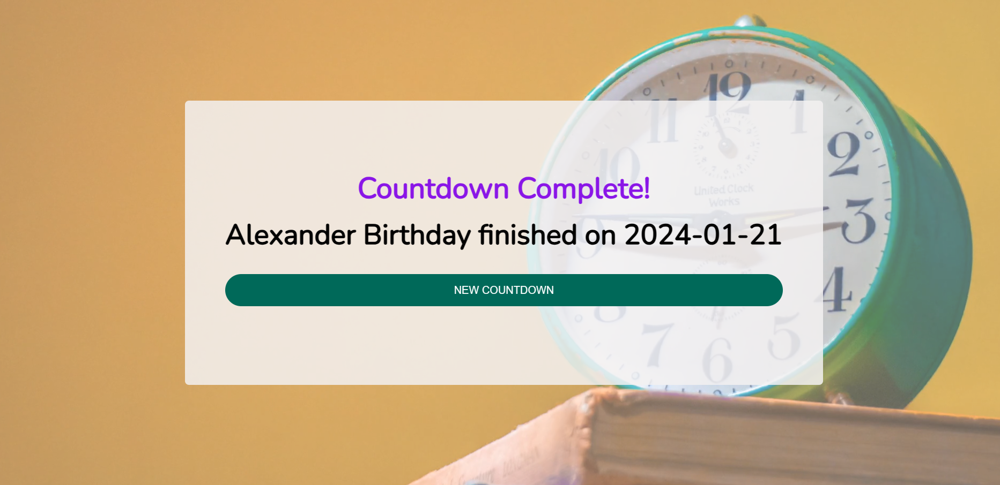

# Custom Countdown App

## Overview

This is a simple web application that allows users to create custom countdowns for important events. Users can set a title and select a date for the event, and the application will display a countdown timer in days, hours, minutes, and seconds until the specified date.

## Features

- **Create Countdowns:** Users can enter a title and select a date for the event they want to countdown to.
- **Real-time Countdown:** The application provides a real-time countdown that dynamically updates every second.
- **Responsive Design:** The app is designed to be responsive and works well on various screen sizes.
- **Background Video:** A captivating background video enhances the visual appeal of the app.

### Live Demo Countdown
## Live Demo
[Live Demo](https://lambrugeorge.github.io/custom-countdown/)
